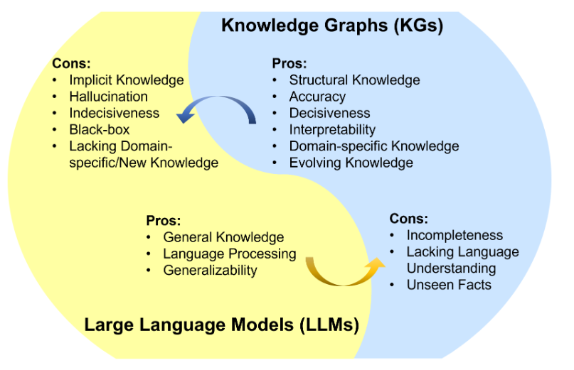

## Notes for paper reading (LLM & KG)

This part of the repository mainly refers to [Awesome-LLM-KG](https://github.com/RManLuo/Awesome-LLM-KG).
- The roadmap paper: [Unifying Large Language Models and Knowledge Graphs: A Roadmap](https://arxiv.org/abs/2306.08302)
- The chinese summary: [统一大型语言模型和知识图谱:路线图](https://mp.weixin.qq.com/s/pjkLp0NsT9EtQye3c6CA6Q)

The summarization of interaction between large language model (LLMs) and knowledge graph (KGs) is illustrated as follows.

## Prompt engineering
This part can refer to [awesome-chatgbt-prompts-zh](https://github.com/PlexPt/awesome-chatgpt-prompts-zh) and [awesome-chatgbt-prompts](https://github.com/f/awesome-chatgpt-prompts).

## Chain of thought
This part can refer to [Chain-of-ThoughtsPapers](https://github.com/Timothyxxx/Chain-of-ThoughtsPapers).

- Active Prompting with Chain-of-Thought for Large Language Models. [[paper](https://arxiv.org/pdf/2302.12246.pdf)] [[blog](https://medium.com/papers-i-found/e5-active-prompting-with-cot-for-llm-343f104bf7b2)] [[code](https://github.com/shizhediao/active-prompt)]

Summary: Uncertainty measure to identify the examples to be annotated for CoT enhances reasoning capabilities of LLMs.

## Tool learning